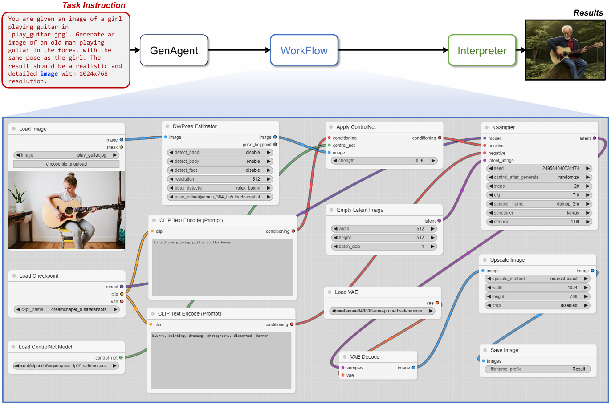
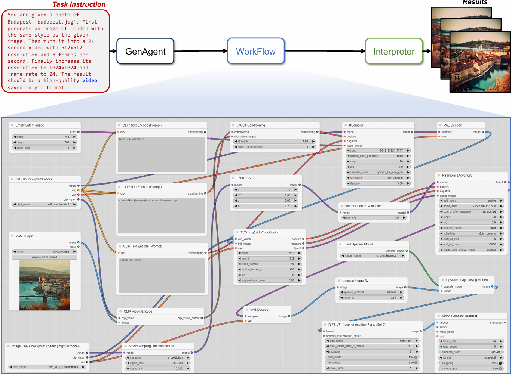

<h1 align="center">
GenAgent: Build Collaborative AI Systems with Automated Workflow Generation - Case Study on ComfyUI
</h1>
<p align="center">
    Implementation for the "GenAgent: Build Collaborative AI Systems with Automated Workflow Generation - Case Study on ComfyUI" paper.
    <br />
    <a href="https://github.com/xxyqwq/"><strong>Xiangyuan Xue</strong></a>
    &nbsp;
    <a href="https://github.com/whlzy/"><strong>Zeyu Lu</strong></a>
    &nbsp;
    <a href="https://dihuang.me/"><strong>Di Huang</strong></a>
    &nbsp;
    <a href="https://wlouyang.github.io/"><strong>Wanli Ouyang</strong></a>
    &nbsp;
    <a href="http://leibai.site/"><strong>Lei Bai</strong></a>*
    <br />
</p>
<p align="center">
    <a href="https://github.com/xxyQwQ/GenAgent">  </a>
    <a href="https://xxyqwq.github.io/GenAgent">  </a>
    <a href="">  </a>
</p>


The GenAgent framework builds collaborative AI systems by creating workflows. The workflows are converted into code so that LLM agents can better understand them. GenAgent can learn from human-designed workflows and create new ones. The generated workflows can be interpreted as collaborative systems to complete complex tasks.

## 🛠️ Configuration

First, clone the repository and navigate to the project directory:

```bash
git clone https://github.com/xxyQwQ/GenAgent
cd GenAgent
```

Then, create a new conda environment and install the dependencies:

```bash
conda create -n genagent python=3.12
conda activate genagent
pip install -r requirements.txt
```

Finally, modify the `config.yaml` file to set HTTP proxy address, OpenAI API key, and ComfyUI server address. Before executing the workflows, you should manually install all the required extensions in ComfyUI.

## 🚀 Execution

Run the following command to execute the GenAgent pipeline:

```bash
# See `main.py` for more parameter settings
python main.py \
    --query_text "input your task requirement" \
    --agent_name "gen_agent" \
    --save_path "path/to/save/result"
```

The log file together with the generated workflow will be saved in the specified path. If your ComfyUI server is working properly, the workflow will be executed automatically, and the result will also be saved in the specified path.

Run the following commands to reproduce the experiments in the paper:

```bash
# Benchmark evaluation
python inference.py --agent_name "zero_shot_agent" "few_shot_agent" "cot_agent" "rag_agent" "gen_agent"
python evaluation.py --agent_name "zero_shot_agent" "few_shot_agent" "cot_agent" "rag_agent" "gen_agent"

# Abalation study
python inference.py --agent_name "json_gen_agent" "list_gen_agent" "code_gen_agent" --num_fixes 0
python evaluation.py --agent_name "json_gen_agent" "list_gen_agent" "code_gen_agent"
```

Make sure that you have set your OpenAI API key in the `config.yaml` file. The benchmark evaluation will cost approximately 30 dollars.

## 🎬 Gallery

Here are some examples of the generated workflows. You can visit our [project page](https://xxyqwq.github.io/GenAgent) for more details.




